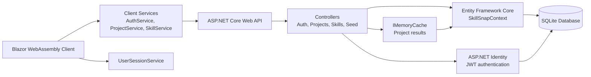

# SkillSnap Architecture

SkillSnap is a Blazor WebAssembly client backed by an ASP.NET Core Web API. The API uses EF Core and SQLite for application data, ASP.NET Identity with JWTs for authentication, and `IMemoryCache` for project query results.

## Architecture Diagram

## Layer Responsibilities

- **Blazor WebAssembly client:** Renders the portfolio interface and communicates with the API through typed client services.
- **Client services:** `ProjectService` and `SkillService` handle API requests; `AuthService` manages authentication; `UserSessionService` stores client session state.
- **API controllers:** Expose authentication, project, skill, and seed endpoints.
- **DTOs:** Shape flat API responses and prevent EF navigation graphs from being serialized directly.
- **In-memory cache:** Stores project DTO results with sliding and absolute expiration policies.
- **EF Core:** Uses `SkillSnapContext` to map portfolio entities, Identity tables, and the `ProjectSkills` many-to-many join table.
- **SQLite:** Persists application and Identity data locally.

## Main Data Relationships

- One `PortfolioUser` can have many `Project` records.
- One `PortfolioUser` can have many `Skill` records.
- A `Project` can have many `Skill` records, and a `Skill` can belong to many `Project` records through `ProjectSkills`.
